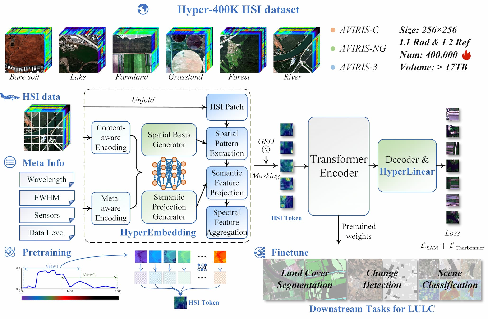

# SpecAware: a spectral-content aware foundation model for unifying multi-sensor learning in hyperspectral remote sensing mapping

This repository provides a PyTorch implementation of the SpecAware model. [Paper Link](https://www.sciencedirect.com/science/article/pii/S0924271626000754)

<!--  -->
<p align="center">

</p>

## SpecAware
Pretrained weights are available [here](https://r2.3sobs.top/share/SpecAware/ckpt/SpecAware_Base_model.pth).

For each input hyperspectral image, the corresponding sensor and dataset parameters are required, including wavelength, FWHM, GSD, sensor name, and processing level.

```
wavelength = [365.9298, 375.5940, 385.2625, ...2496.236]
FWHM = [9.85211, 9.79698, 9.74410, ...9.99943]
GSD = 10.0
name = "others"
level = "L1"
```

A python environment used in our experiments:

```
python    = 3.11.11
pytorch   = 2.5.1
torchdata = 0.11.0
timm      = 1.0.15
sentence-transformers = 4.1.0
gdal      = 3.6.2
```

## Hyper-400K

All data used to construct the pre-training dataset were obtained from the official AVIRIS data portal. We provide a file manifest and some scripts under [`Hyper-400K/`](Hyper-400K).

You can download the raw AVIRIS products from the official portal by following the entries in the manifest.

An example subset is being prepared for release.

## Citation
Please cite our paper if our work is helpful for your research.

[1] Ji, R., Wang, X., Niu, C., Zhang, W., Mei, Y., Tan, K., 2026. SpecAware: a spectral-content aware foundation model for unifying multi-sensor learning in hyperspectral remote sensing mapping. ISPRS J. Photogramm. Remote Sens. 234, 242–260.

## Contact
For questions or feedback, please contact: ecnu.jirenjie@gmail.com.